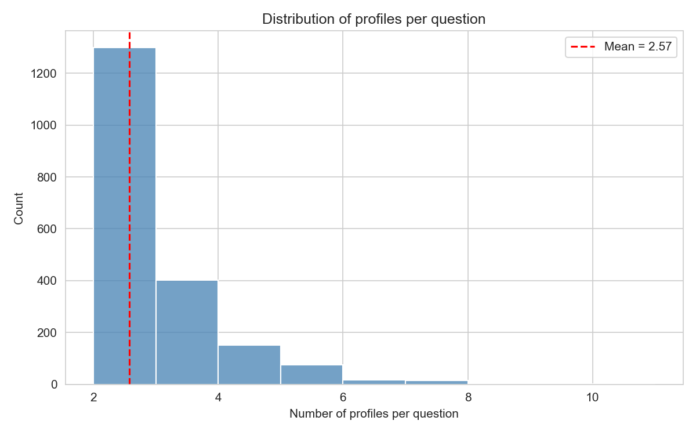
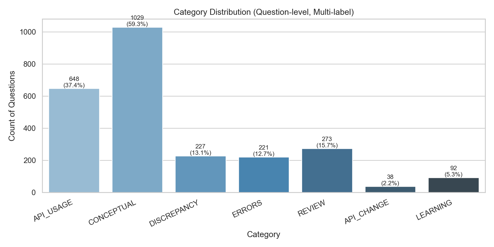
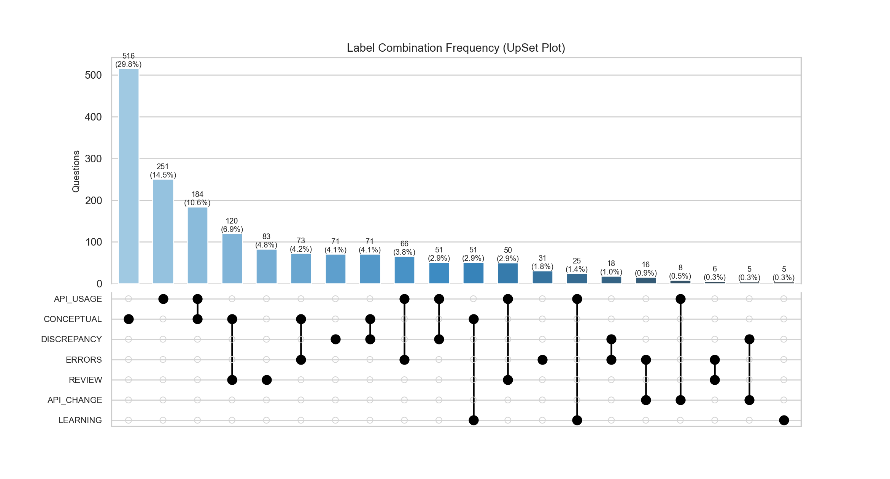

# Construction of MAP-PPL Dataset

## 📌 一. 建立 canonical_question_pair 数据集 (output_qap.jsonl)
- 目的：获取更精简的数据集以方便分析
- 输入：两个文件。queries_selected_latest.jsonl 是一份筛选好的 canonical question ID 清单，相当于"我们关心哪些问题"。raw_data.jsonl 是完整的 StackOverflow 数据，包含每个 canonical 问题及其所有 duplicate 问题的详细信息（提问内容、提问者资料、回答等）。

#### queries_selected_latest.jsonl 輸入样例
```jsonl
{"question_id": "43431550", 
 "combined_text": "How can I invoke asynchronous code within a constructor?\n\nAt the moment, I'm attempting to use async/await within a class constructor function. This is so that I can get a custom e-mail tag for an Electron project I'm working on. customElements.define('e-mail', class extends HTMLElement { async constructor() { super() let uid = this.getAttribute('data-uid') let message = await grabUID(uid) const shadowRoot = this.attachShadow({mode: 'open'}) shadowRoot.innerHTML = ` A random email message has appeared. ${message} ` } }) At the moment however, the project does not work, with the following error: Class constructor may not be an async method Is there a way to circumvent this so that I can use async/await within this? Instead of requiring callbacks or .then()?"
 }
```

#### output_qap.jsonl 輸出格式
```jsonl
{
  "canonical_query": "xxxxx",
  "profiles_answers": [
    {
      "profile": {
        "self_description": "xxxxxx",
        "skills": ["xx", "xxx"],
      },
      "answer": "xxxxxxxxxxxxxxx"
    },
    {
      "profile": {
        "self_description": "xxxxxxxxxxxxxx",
        "skills": ["xxxx", "xx"]
      },
      "answer": "xxxxxxxxxxxxxxxxx"
    }
  ]
}
```
处理逻辑：以 ID 清单为准，逐个去完整数据中查找对应记录。对每条记录，它提取 canonical 问题的 title+body 拼接成一个 query，然后为 canonical 本身以及它的每一个 duplicate 分别提取两样东西——提问者的用户画像（自我介绍 + 擅长的技术标签）和该问题下被采纳的答案正文。这些 profile+answer 对被放进一个列表里，其中第一个元素固定是 canonical 的，后续的是各个 duplicate 的。

#### 程序码样例
```python
import json
import os

#读取 JSONL 文件，每行一条 JSON。
def load_jsonl(filepath):
    data = []
    with open(filepath, 'r', encoding='utf-8-sig') as f:
        for line in f:
            line = line.strip()
            if not line:
                continue
            try:
                data.append(json.loads(line))
            except json.JSONDecodeError as e:
                print(f"  ⚠ 跳过无法解析的行: {e}")
    return data

#将 title 和 body 拼接为 query。
def build_query(question):
    title = question.get('title', '')
    body = question.get('body', '')
    return f"{title}\n\n{body}"

#从 question_author 中提取 self_description 和 skills。
def extract_user_profile(question_author):
    self_description = question_author.get('about_me', '')
    top_tags = question_author.get('top_tags', [])
    skills = [tag['tag_name'] for tag in top_tags if 'tag_name' in tag]
    return {
        'self_description': self_description,
        'skills': skills
    }

# 从 canonical 的 accepted_answer 字段中提取被采纳答案的 body。
def extract_canonical_accepted_answer(accepted_answer_data):
    if not accepted_answer_data:
        return None
    answer = accepted_answer_data.get('answer', {})
    if answer.get('is_accepted', False):
        return answer.get('body', '')
    return None

#从 duplicate 的 answers 列表中找到 is_accepted==true 的答案，提取 body。
def extract_duplicate_accepted_answer(answers):
    if not answers:
        return None
    for ans_data in answers:
        answer = ans_data.get('answer', {})
        if answer.get('is_accepted', False):
            return answer.get('body', '')
    return None

#最终数据整理
def process_data(queries_file, full_data_file, output_file):
    # Step 1: 读取 canonical question ID 列表
    queries = load_jsonl(queries_file)
    canonical_ids = set(str(q['question_id']) for q in queries)  #有可能會導致複製實驗時順序不一樣，但結果應該相同
    print(f"共读取 {len(canonical_ids)} 个 canonical question ID")

    # Step 2: 读取完整数据，按 canonical question_id 建索引
    full_data = load_jsonl(full_data_file)
    data_index = {}
    for record in full_data:
        canonical = record.get('canonical', {})
        question = canonical.get('question', {})
        qid = str(question.get('question_id', ''))
        if qid:
            data_index[qid] = record
    print(f"完整数据共 {len(data_index)} 条")

    # Step 3: 逐条处理
    results = []
    missing = 0

    for qid in canonical_ids:
        if qid not in data_index:
            print(f"  ⚠ question_id {qid} 在完整数据中未找到，跳过")
            missing += 1
            continue

        record = data_index[qid]
        canonical = record['canonical']

        # Canonical 部分
        canonical_query = build_query(canonical['question'])
        canonical_profile = extract_user_profile(
            canonical.get('question_author', {})
        )
        canonical_answer = extract_canonical_accepted_answer(
            canonical.get('accepted_answer', {})
        )

        # 构建 profiles_answers 列表
        profiles_answers = []

        # 先放 canonical 的 profile + answer
        profiles_answers.append({
            'profile': canonical_profile,
            'answer': canonical_answer
        })

        # 再放每个 duplicate 的 profile + answer（不需要 query）
        for dup in record.get('duplicates', []):
            dup_profile = extract_user_profile(
                dup.get('question_author', {})
            )
            dup_answer = extract_duplicate_accepted_answer(
                dup.get('answers', [])
            )
            profiles_answers.append({
                'profile': dup_profile,
                'answer': dup_answer
            })

        # 组装一条完整记录
        result = {
            'question_id': qid,
            'canonical_query': canonical_query,
            'profiles_answers': profiles_answers
        }
        results.append(result)

    # Step 4: 写出结果
    with open(output_file, 'w', encoding='utf-8') as f:
        for r in results:
            f.write(json.dumps(r, ensure_ascii=False) + '\n')

    print(f"\n✅ 处理完成：{len(results)} 条写入 {output_file}，{missing} 条未匹配")


if __name__ == '__main__':
    script_dir = os.path.dirname(os.path.abspath(__file__))

    queries_file = os.path.join(script_dir, 'queries_selected_latest.jsonl')
    full_data_file = os.path.join(script_dir, 'filtered_output_no_similarity_completed.jsonl')
    output_file = os.path.join(script_dir, 'output_qap.jsonl')

    process_data(queries_file, full_data_file, output_file)
```

#### 輸出样例
```jsonl
{
  "question_id": "4371716",
  "canonical_query": "How to avoid NoMethodError for missing elements in nested hashes, without repeated nil checks?\n\nI'm looking for a good way to avoid checking for nil at each level in deeply nested hashes. For example: name = params[:company][:owner][:name] if params[:company] && params[:company][:owner] && params[:company][:owner][:name] This requires three checks, and makes for very ugly code. Any way to get around this?",
  "profiles_answers": [
    {
      "profile": {
        "self_description": "A Ruby on Rails, Swift, and JS developer with a passion for creating beautiful programs for the web and mobile. Twitter Facebook Google",
        "skills": ["ruby-on-rails", "iphone", "ruby", "fish", "ios"]
      },
      "answer": "Ruby 2.3.0 introduced a method called dig on both Hash and Array. name = params.dig(:company, :owner, :name) It returns nil if the key is missing at any level. If you are using a version of Ruby older than 2.3, you can install a gem such as ruby_dig or hash_dig_and_collect, or implement the functionality yourself: module RubyDig def dig(key, *rest) if value = (self[key] rescue nil) if rest.empty? value elsif value.respond_to?(:dig) value.dig(*rest) end end end end if RUBY_VERSION"
    },
    {
      "profile": {
        "self_description": "Twitter: @jackkinsella",
        "skills": ["ruby-on-rails", "ruby", "ruby-on-rails-3", "rspec", "cucumber"]
      },
      "answer": "Check Ick's maybe. You don't need to significantly refactor your code, just intersperse maybe proxies when necessary: params[:subject].maybe[:name] The same author (raganwald) also wrote andand, with the same idea."
    },
    {
      "profile": {
        "self_description": "Game and web developer in San Francisco. Curator of Coding for Interviews, weekly CS topic overview and programming interview practice problem.",
        "skills": ["ruby-on-rails", "ruby", "hash", "yaml", "python"]
      },
      "answer": "When using ActiveSupport (Rails) or Backports, you can use try: @hash[:key1].try(:fetch, :key2) You could even handle @hash being nil: @hash.try(:fetch, :key1).try(:fetch, :key2) If you want @hash to always return a hash for a missing key: @hash = Hash.new { |h,k| h[k] = {} } @hash[:foo] # => {} You could also define this recursive: def recursive_hash Hash.new { |h,k| h[k] = recursive_hash } end @hash = recursive_hash @hash[:foo][:bar][:blah] = 10 @hash # => {:foo => {:bar => {:blah => 10}}} But to answer your question: module HasNestedKey Hash.send(:include, self) def has_nested_key?(*args) return false unless sub = self[args.shift] return true if args.empty? sub.respond_to?(:has_nested_key?) and sub.has_nested_key?(*args) end end @hash.has_nested_key? :key1, :key2"
    },
    {
      "profile": {
        "self_description": "I like: Ruby on Rails, Mobile Apps, IT/Strategy, Travel, etc. etc.",
        "skills": ["sql", "ruby-on-rails", "sql-server", "ruby", "database"]
      },
      "answer": "Something like: def follow_hash(hash, path) path.inject(hash) { |accum, el| accum && accum[el] } end value = follow_hash(hash, [:foo, :bar, :baz]) puts value if value"
    },
    {
      "profile": {
        "self_description": "Polyglot engineer and people leader.",
        "skills": ["ruby-on-rails", "ruby-on-rails-3", "ruby", "activerecord", "sql"]
      },
      "answer": "if you are just trying to see if its defined why not keep it simple and use the defined? function? if defined?(params[:search][:tags_name_in])"
    }
  ]
}
```

#### 統計
统计逻辑：然后我们对上面的数据进行统计，初步考究一下他的数据规模，profile 总量，有效 answer 数，平均每条问题的 profile/answer 数

```python
import json
import matplotlib.pyplot as plt
import seaborn as sns

# ── 读取数据 ──
data = []
with open('output_qap.jsonl', 'r', encoding='utf-8') as f:
    for line in f:
        line = line.strip()
        if line:
            data.append(json.loads(line))

# ── 基础统计 ──
total_questions = len(data)
counts = [len(item['profiles_answers']) for item in data]
total_profiles = sum(counts)
avg_profiles = total_profiles / total_questions if total_questions else 0

# 有多少条 answer 不为 None
total_answers = sum(
    1 for item in data
    for pa in item['profiles_answers']
    if pa.get('answer') is not None
)

print(f"总问题数:           {total_questions}")
print(f"总 profile 数:      {total_profiles}")
print(f"总有效 answer 数:   {total_answers}")
print(f"每条问题平均 profile/answer 数: {avg_profiles:.2f}")
print(f"最少: {min(counts)}  最多: {max(counts)}")

# 画图
sns.set_style("whitegrid")
fig, ax = plt.subplots(figsize=(8, 5))

sns.histplot(counts, bins=range(min(counts), max(counts) + 2),
             color='steelblue', edgecolor='white', ax=ax)
ax.set_xlabel('Number of profiles per question')
ax.set_ylabel('Count')
ax.set_title('Distribution of profiles per question')
ax.axvline(avg_profiles, color='red', linestyle='--', label=f'Mean = {avg_profiles:.2f}')
ax.legend()

plt.tight_layout()
plt.savefig('output_qap_stats.png', dpi=150)
plt.show()

print(f"\n图已保存为 output_qap_stats.png")
```
- 总问题数:           1967
- 总 profile 数:      5054
- 总有效 answer 数:   5054
- 每条问题平均 profile/answer 数: 2.57
- 最少: 2 &nbsp; 最多: 10



---
## 📌 二. 对无意义的profile进行筛选
- 目的：由于我们需要对数据集进行个性化训练，因此回答profile中的个人introduction的意义将显得重要，我们需要对毫无意义的introduction筛选掉
- 输入：output_qap.jsonl
- 代码逻辑：把output_qap.jsonl先拆开成id和profile, 然后用大模型对profile的introduction的字面意义作分析，如果没有意义则会被删除，然后再增加回一个新的file裏面。
- 输出：filtered_qap.jsonl


#### 二.一 对数据进行拆分(creating_profile_pairs.py)
```python
import json

input_path = r"<repo>/construction/pipeline/task_2\output_qap.jsonl"
output_path = r"<repo>/construction/pipeline/task_2\questionid_profile_pairs.jsonl"

# 读取
data = []
with open(input_path, "r", encoding="utf-8") as f:
    for line in f:
        line = line.strip()
        if line:
            data.append(json.loads(line))

# 拆分：一個問題有幾個profile就拆出多少行
pairs = []
for entry in data:
    qid = entry.get("question_id")
    for pa in entry.get("profiles_answers", []):
        pairs.append({
            "question_id": qid,
            "profile": pa.get("profile"),
            "answer": pa.get("answer")
        })

# 保存 
with open(output_path, "w", encoding="utf-8") as f:
    for p in pairs:
        f.write(json.dumps(p, ensure_ascii=False) + "\n")

# 打印總結
print(f"总 question 数: {len(data)}")
print(f"拆分出 pairs 数: {len(pairs)}")
print(f"已保存: {output_path}")
```
- 总 question 数: 1967
- 拆分出 pairs 数: 5054

##### 拆分示例(questionid_profile_pairs.jsonl)
```jsonl
{"question_id": "10797794", "profile": {"self_description": "always learning", "skills": ["google-colaboratory", "php", "gsutil", "java", "xml"]}, "answer": "a imple way is using batch SQL insert sql = \"INSERT INTO `table` (something, something) VALUES (smth,smth), (smth,smth)\"; this is a standard sql weay for insert more rows with an single query"}
```

#### 二.二 大模型对profile进行筛选(AI_model_classification.py)
处理逻辑：读取所有 question-profile pairs，把 profile 的 self_description 和 skills 以 JSONL 格式分批（每批 30 笔）送给 GPT-4o，让它判断每个 self_description 是否 meaningful（包含职业、技能、学历等具体资讯 → true；只有打招呼、纯连结、废话 → false），同时给出 confidence（high/medium/low）。用 3 线程并发加速，结果按 id 匹配回原始资料，写入 annotated_output.jsonl。
```python
import openai
import os
import time
import json
import re
from concurrent.futures import ThreadPoolExecutor, as_completed

client = openai.OpenAI(
    api_key = (os.getenv("POE_API_KEY")), #切換成你的Key
    base_url="https://api.poe.com/v1",
)

BATCH_SIZE = 30        
MAX_WORKERS = 3        
RETRY_LIMIT = 2        
RETRY_DELAY = 3        
SUBMIT_DELAY = 0.5     

# 輸入 / 輸出路徑
pairs_path  = r"<repo>/construction/pipeline/task_2\questionid_profile_pairs.jsonl"
output_path = r"<repo>/construction/pipeline/task_2\annotated_output.jsonl"


system_prompt = """You are a data annotator. You will receive a JSONL of user profiles, each with "id", "self_description", and "skills".

For EACH profile, determine whether "self_description" is meaningful.

=== MEANINGFUL (true) ===
Contains at least one of:
1. Professional role or job title (e.g., "software engineer at Google", "Software Engineer", "Software Developer")
2. Technical skills, tools, or programming languages (e.g., "experienced in Python and ML", "Refactoring specialist")
3. Educational background (e.g., "PhD in CS", "Stanford graduate")
4. Domain expertise or field of work (e.g., "working in fintech", "NLP researcher")
5. Years of experience or career stage (e.g., "10 years in backend dev", "junior developer")
6. Specific interests indicating knowledge depth (e.g., "passionate about distributed systems")
7. Geographic or organizational context (e.g., "based in Berlin, working on open-source")
8. Any concrete personal attribute that could shape how they answer technical questions

=== NOT MEANINGFUL (false) ===
1. Only greetings, pleasantries, or filler (e.g., "Hello!", "Nice to meet you")
2. Only emojis, symbols, or decorative text
3. Only vague/generic statements (e.g., "I like computers", "Just a guy")
4. Only a URL or social media handle with no descriptive text
5. Only motivational quotes or copy-pasted irrelevant text
6. Spam, gibberish, or completely irrelevant content
7. Only a name with no additional info

=== EXAMPLES ===

INPUT:
{"id": 0, "self_description": "A Ruby on Rails, Swift, and JS developer with a passion for creating beautiful programs for the web and mobile.", "skills": ["ruby-on-rails", "iphone", "ruby"]}
{"id": 1, "self_description": "Twitter: @jackkinsella", "skills": ["ruby-on-rails", "ruby", "rspec"]}
{"id": 2, "self_description": "Game and web developer in San Francisco. Curator of Coding for Interviews.", "skills": ["ruby-on-rails", "ruby", "python"]}
{"id": 3, "self_description": "I love coding", "skills": ["sql", "ruby-on-rails", "ruby"]}
{"id": 4, "self_description": "Polyglot engineer and people leader.", "skills": ["ruby-on-rails", "ruby", "activerecord", "sql"]}

OUTPUT:
{"id": 0, "is_meaningful": true, "meaningful_confidence": "high"}
{"id": 1, "is_meaningful": false, "meaningful_confidence": "high"}
{"id": 2, "is_meaningful": true, "meaningful_confidence": "high"}
{"id": 3, "is_meaningful": false, "meaningful_confidence": "high"}
{"id": 4, "is_meaningful": true, "meaningful_confidence": "high"}

=== RULES ===
- Return ONLY JSONL, one JSON object per line, one per input profile.
- Each object must have exactly: "id" (matching input), "is_meaningful" (boolean), "meaningful_confidence" ("high"/"medium"/"low").
- NO explanation, NO markdown, NO code fences. ONLY valid JSONL."""

# 讀取原始資料
pairs = []
with open(pairs_path, "r", encoding="utf-8") as f:
    for line in f:
        if line.strip():
            pairs.append(json.loads(line))

print(f"📂 共讀取 {len(pairs)} 筆原始資料")


# 提取profile

all_records = []    # 每筆的標註狀態
api_queue = []      # 需要 API 標註的索引列表

for i, p in enumerate(pairs):
    profile = p.get("profile", {})
    desc = profile.get("self_description", "")
    skills = profile.get("skills", [])
    
    record = {
        "index": i,                       # 內部索引，和 pairs[i] 對應
        "self_description": desc,
        "skills": skills,
        "is_meaningful": None,            # 待填
        "meaningful_confidence": None,    # 待填
    }
    
    api_queue.append(i) 
    all_records.append(record)

total_batches = (len(api_queue) + BATCH_SIZE - 1) // BATCH_SIZE

print(f"🤖 需 API 標註: {len(api_queue)} 筆 → {total_batches} 批（每批 {BATCH_SIZE}）")


# API調用
def call_api_for_batch(batch_indices: list, batch_num: int) -> list:
    """
    對一批 profile 調用 GPT-4o 進行標註。
    
    參數:
        batch_indices: 這批要處理的 all_records 索引
        batch_num:     批次編號（用於日誌）
    
    回傳:
        [(index, is_meaningful, meaningful_confidence), ...] 
    """
    # 組裝發給 API 的 JSONL
    # 用 all_records 的 index 作為 id（保證唯一）
    batch_profiles = []
    for idx in batch_indices:
        rec = all_records[idx]
        batch_profiles.append({
            "id": idx,
            "self_description": rec["self_description"],
            "skills": rec["skills"],
        })
    
    input_jsonl_str = "\n".join(json.dumps(p, ensure_ascii=False) for p in batch_profiles)
    
    user_message = f"""=== INPUT ===
{input_jsonl_str}

=== OUTPUT ==="""
    
    # 帶重試的 API 調用 
    for attempt in range(1, RETRY_LIMIT + 1):
        try:
            chat = client.chat.completions.create(
                model="gpt-4o",
                messages=[
                    {"role": "system", "content": system_prompt},
                    {"role": "user", "content": user_message},
                ],
                temperature=0,
                max_tokens=4096,
            )
            
            result_text = chat.choices[0].message.content.strip()
            
            # 解析回傳的 JSONL
            # 用 id → label 的字典匹配，不依賴順序（修正原版按位置匹配的 bug）
            label_map = {}
            for line in result_text.split("\n"):
                line = line.strip()
                if not line:
                    continue
                try:
                    obj = json.loads(line)
                    label_map[obj["id"]] = obj
                except (json.JSONDecodeError, KeyError):
                    pass  # 跳過無法解析的行
            
            # 將標註結果和原始索引配對
            results = []
            for idx in batch_indices:
                if idx in label_map:
                    label = label_map[idx]
                    results.append((
                        idx,
                        label.get("is_meaningful"),
                        label.get("meaningful_confidence"),
                    ))
                else:
                    results.append((idx, None, None))
            
            matched = sum(1 for _, m, _ in results if m is not None)
            print(f"  ✅ 批次 {batch_num}/{total_batches} 完成（匹配 {matched}/{len(batch_indices)}）")
            return results
        
        except Exception as e:
            print(f"  ⚠️ 批次 {batch_num} 第 {attempt} 次失敗: {e}")
            if attempt < RETRY_LIMIT:
                time.sleep(RETRY_DELAY)
    
    # 全部重試都失敗
    print(f"  ❌ 批次 {batch_num} 徹底失敗")
    return [(idx, None, None) for idx in batch_indices]

# 把 api_queue 切成多個 batch
batches = [api_queue[i:i + BATCH_SIZE] for i in range(0, len(api_queue), BATCH_SIZE)]

print(f"\n🚀 開始並發處理（{MAX_WORKERS} 線程）...\n")
start_time = time.time()

with ThreadPoolExecutor(max_workers=MAX_WORKERS) as executor:
    # 提交所有批次任務到線程池
    future_to_batch = {}
    for batch_num, batch_indices in enumerate(batches, 1):
        future = executor.submit(call_api_for_batch, batch_indices, batch_num)
        future_to_batch[future] = batch_num
        time.sleep(SUBMIT_DELAY)  # 錯開提交時間，避免同時打 API 觸發限流
    
    # 按完成順序收集結果
    for future in as_completed(future_to_batch):
        batch_num = future_to_batch[future]
        try:
            results = future.result()
            # 將標註結果寫回 all_records
            # 注意：每個 batch 的 indices 互不重疊，不會有 race condition
            for idx, is_meaningful, confidence in results:
                all_records[idx]["is_meaningful"] = is_meaningful
                all_records[idx]["meaningful_confidence"] = confidence
        except Exception as e:
            print(f"  ❌ 批次 {batch_num} 收集結果時出錯: {e}")

elapsed = time.time() - start_time
print(f"\n⏱️ API 處理總耗時: {elapsed:.1f} 秒")

#最終輸出
with open(output_path, "w", encoding="utf-8") as f:
    for i, rec in enumerate(all_records):
        # 以原始 pair 為基底，保留所有原始欄位（question_id, profile 等）
        output = dict(pairs[i])
        output["is_meaningful"] = rec["is_meaningful"]
        output["meaningful_confidence"] = rec["meaningful_confidence"]
        f.write(json.dumps(output, ensure_ascii=False) + "\n")


# 統計結果
success_count    = sum(1 for r in all_records if r["is_meaningful"] is not None)
fail_count       = sum(1 for r in all_records if r["is_meaningful"] is None)
meaningful_true  = sum(1 for r in all_records if r["is_meaningful"] is True)
meaningful_false = sum(1 for r in all_records if r["is_meaningful"] is False)

print(f"\n{'=' * 55}")
print(f"🎉 標註完成！")
print(f"   總筆數:          {len(all_records)}")
print(f"   API 標註成功:    {success_count} 筆")
print(f"   標註失敗 (None): {fail_count} 筆")
print(f"   ─────────────────────────")
print(f"   meaningful:      {meaningful_true} 筆")
print(f"   not meaningful:  {meaningful_false} 筆")
print(f"   ─────────────────────────")
print(f"   輸出檔案: {output_path}")
print(f"{'=' * 55}")
```
- 总笔数:          5054
- API 标註成功:    5054 笔
- 标註失败 (None): 0 笔
- meaningful:      3045 笔
- not meaningful:  2009 笔
- meaningful profile 佔全部 profile 的 58.9%

##### annotated_output.jsonl 示例
```jsonl
{"question_id": "75666408", "profile": {"self_description": "I work for Audulus and I'm learning Python, JavaScript, and Lua!", "skills": ["python", "string", "replace", "list"]}, "answer": "Use dictionaries and list comprehension like so: dct = {'X': True, 'O': False} bool_lists = [[dct[c] for c in s] for s in arr] print(bool_lists) # [[True, False, False, True, False], [True, False, False, True, False], [False, False, False, True, False], [True, True, False, True, False], [False, True, False, False, False]]", "is_meaningful": true, "meaningful_confidence": "medium"}
```

#### 二.三 以更強大的模型对profile进行再筛选(Cascade_model.py)
处理逻辑：由于AI在读取大量输出的时候可能会出错，所以我们使用更強的模型對可能出錯的profile去验证，读取第一轮的输出，筛出三类需要重新审查的 profile：同一个 profile 在不同 entry 中被标成矛盾结果（既有 true 又有 false）、confidence 为 low 或 medium、以及第一轮完全失败（None）的。对这些 profile 去重后，送给更强的 Claude 4.6 Opus 重新判断，仲裁结果复盖回所有对应 entry，写入 annotated_output_final.jsonl，确保边界案例的准确度。

```python
import openai
import os
import time
import json
from collections import defaultdict
from concurrent.futures import ThreadPoolExecutor, as_completed

# ============================================================
# 🔧 配置區
# ============================================================

client = openai.OpenAI(
    api_key = (os.getenv("POE_API_KEY")), #切換成你的key
    base_url="https://api.poe.com/v1",
)

BATCH_SIZE = 20        # 第二輪量少，batch 可以小一點，更穩
MAX_WORKERS = 2
RETRY_LIMIT = 3        # 仲裁輪多給幾次重試機會
RETRY_DELAY = 5
SUBMIT_DELAY = 1.0

# 第一輪的輸出 = 第二輪的輸入
input_path  = r"<repo>/construction/pipeline/task_2\annotated_output.jsonl"
output_path = r"<repo>/construction/pipeline/task_2\annotated_output_final.jsonl"

# 仲裁用的強模型
CASCADE_MODEL = "claude-opus-4.6" 

system_prompt = """You are a senior data annotator performing a FINAL review. You will receive a JSONL of user profiles, each with "id", "self_description", and "skills".

For EACH profile, determine whether "self_description" is meaningful.

=== MEANINGFUL (true) ===
Contains at least one of:
1. Professional role or job title (e.g., "software engineer at Google", "Software Engineer", "Software Developer")
2. Technical skills, tools, or programming languages (e.g., "experienced in Python and ML", "Refactoring specialist")
3. Educational background (e.g., "PhD in CS", "Stanford graduate")
4. Domain expertise or field of work (e.g., "working in fintech", "NLP researcher")
5. Years of experience or career stage (e.g., "10 years in backend dev", "junior developer")
6. Specific interests indicating knowledge depth (e.g., "passionate about distributed systems")
7. Geographic or organizational context (e.g., "based in Berlin, working on open-source")
8. Any concrete personal attribute that could shape how they answer technical questions

=== NOT MEANINGFUL (false) ===
1. Only greetings, pleasantries, or filler (e.g., "Hello!", "Nice to meet you")
2. Only emojis, symbols, or decorative text
3. Only vague/generic statements (e.g., "I like computers", "Just a guy")
4. Only a URL or social media handle with no descriptive text
5. Only motivational quotes or copy-pasted irrelevant text
6. Spam, gibberish, or completely irrelevant content
7. Only a name with no additional info

=== EXAMPLES ===

INPUT:
{"id": 0, "self_description": "A Ruby on Rails, Swift, and JS developer with a passion for creating beautiful programs for the web and mobile.", "skills": ["ruby-on-rails", "iphone", "ruby"]}
{"id": 1, "self_description": "Twitter: @jackkinsella", "skills": ["ruby-on-rails", "ruby", "rspec"]}
{"id": 2, "self_description": "Game and web developer in San Francisco. Curator of Coding for Interviews.", "skills": ["ruby-on-rails", "ruby", "python"]}
{"id": 3, "self_description": "I love coding", "skills": ["sql", "ruby-on-rails", "ruby"]}
{"id": 4, "self_description": "Polyglot engineer and people leader.", "skills": ["ruby-on-rails", "ruby", "activerecord", "sql"]}

OUTPUT:
{"id": 0, "is_meaningful": true, "meaningful_confidence": "high"}
{"id": 1, "is_meaningful": false, "meaningful_confidence": "high"}
{"id": 2, "is_meaningful": true, "meaningful_confidence": "high"}
{"id": 3, "is_meaningful": false, "meaningful_confidence": "high"}
{"id": 4, "is_meaningful": true, "meaningful_confidence": "high"}

=== RULES ===
- Return ONLY JSONL, one JSON object per line, one per input profile.
- Each object must have exactly: "id" (matching input), "is_meaningful" (boolean), "meaningful_confidence" ("high"/"medium"/"low").
- NO explanation, NO markdown, NO code fences. ONLY valid JSONL."""


# ============================================================
# 📂 讀取第一輪結果
# ============================================================

entries = []
with open(input_path, "r", encoding="utf-8") as f:
    for line in f:
        if line.strip():
            entries.append(json.loads(line))

print(f"📂 讀取第一輪結果: {len(entries)} 筆")


# ============================================================
# 🔍 找出需要仲裁的 profile
# ============================================================

# 用 (self_description, skills_tuple) 作為 profile key
def make_key(entry):
    profile = entry.get("profile", {})
    desc = profile.get("self_description", "")
    skills = tuple(sorted(profile.get("skills", [])))
    return (desc, skills)

# 1) 找矛盾的 profile：同一個 key 出現 true 和 false
key_to_labels = defaultdict(set)
for entry in entries:
    label = entry.get("is_meaningful")
    if label is not None:
        key_to_labels[make_key(entry)].add(label)

contradicted_keys = {k for k, v in key_to_labels.items() if len(v) > 1}

# 2) 找 low / medium confidence 的 profile
low_med_keys = set()
for entry in entries:
    conf = entry.get("meaningful_confidence", "")
    if conf in ("low", "medium"):
        low_med_keys.add(make_key(entry))

# 3) 合併：需要仲裁的 unique profile keys
needs_review_keys = contradicted_keys | low_med_keys

# 4) 找 None 的（第一輪失敗的）
none_keys = set()
for entry in entries:
    if entry.get("is_meaningful") is None:
        none_keys.add(make_key(entry))

needs_review_keys = needs_review_keys | none_keys

print(f"🔍 矛盾 profile:          {len(contradicted_keys)} 個 unique")
print(f"🔍 low/medium confidence:  {len(low_med_keys)} 個 unique")
print(f"🔍 第一輪失敗 (None):      {len(none_keys)} 個 unique")
print(f"🔍 合併去重後需仲裁:       {len(needs_review_keys)} 個 unique profile")

if len(needs_review_keys) == 0:
    print("✅ 沒有需要仲裁的 profile，直接複製第一輪結果。")
    with open(output_path, "w", encoding="utf-8") as f:
        for entry in entries:
            f.write(json.dumps(entry, ensure_ascii=False) + "\n")
    print(f"💾 輸出: {output_path}")
    exit()


# ============================================================
# 📋 為需要仲裁的 profile 建立 unique 列表
# ============================================================

# 每個 unique key 只取一個代表，給一個 review_id
review_profiles = []  # [{"review_id": int, "key": tuple, "desc": str, "skills": list}, ...]
key_to_review_id = {}

for entry in entries:
    key = make_key(entry)
    if key in needs_review_keys and key not in key_to_review_id:
        rid = len(review_profiles)
        profile = entry.get("profile", {})
        review_profiles.append({
            "review_id": rid,
            "key": key,
            "self_description": profile.get("self_description", ""),
            "skills": profile.get("skills", []),
        })
        key_to_review_id[key] = rid

total_batches = (len(review_profiles) + BATCH_SIZE - 1) // BATCH_SIZE
print(f"🤖 送仲裁: {len(review_profiles)} 個 unique profile → {total_batches} 批")


# ============================================================
# 🌐 API 調用（同第一輪結構）
# ============================================================

review_results = {}  # review_id → {"is_meaningful": bool, "meaningful_confidence": str}

def call_api_for_batch(batch_items: list, batch_num: int) -> list:
    batch_for_api = []
    for item in batch_items:
        batch_for_api.append({
            "id": item["review_id"],
            "self_description": item["self_description"],
            "skills": item["skills"],
        })
    
    input_jsonl_str = "\n".join(json.dumps(p, ensure_ascii=False) for p in batch_for_api)
    
    user_message = f"""=== INPUT ===
{input_jsonl_str}

=== OUTPUT ==="""
    
    for attempt in range(1, RETRY_LIMIT + 1):
        try:
            chat = client.chat.completions.create(
                model=CASCADE_MODEL,
                messages=[
                    {"role": "system", "content": system_prompt},
                    {"role": "user", "content": user_message},
                ],
                temperature=0,
                max_tokens=4096,
            )
            
            result_text = chat.choices[0].message.content.strip()
            
            label_map = {}
            for line in result_text.split("\n"):
                line = line.strip()
                if not line:
                    continue
                try:
                    obj = json.loads(line)
                    label_map[obj["id"]] = obj
                except (json.JSONDecodeError, KeyError):
                    pass
            
            results = []
            for item in batch_items:
                rid = item["review_id"]
                if rid in label_map:
                    results.append((rid, label_map[rid]))
                else:
                    results.append((rid, None))
            
            matched = sum(1 for _, r in results if r is not None)
            print(f"  ✅ 仲裁批次 {batch_num}/{total_batches} 完成（匹配 {matched}/{len(batch_items)}）")
            return results
        
        except Exception as e:
            print(f"  ⚠️ 仲裁批次 {batch_num} 第 {attempt} 次失敗: {e}")
            if attempt < RETRY_LIMIT:
                time.sleep(RETRY_DELAY)
    
    print(f"  ❌ 仲裁批次 {batch_num} 徹底失敗")
    return [(item["review_id"], None) for item in batch_items]


# ============================================================
# 🚀 並發處理仲裁
# ============================================================

batches = [review_profiles[i:i + BATCH_SIZE] for i in range(0, len(review_profiles), BATCH_SIZE)]

print(f"\n🚀 開始仲裁（{CASCADE_MODEL}, {MAX_WORKERS} 線程）...\n")
start_time = time.time()

with ThreadPoolExecutor(max_workers=MAX_WORKERS) as executor:
    future_to_batch = {}
    for batch_num, batch_items in enumerate(batches, 1):
        future = executor.submit(call_api_for_batch, batch_items, batch_num)
        future_to_batch[future] = batch_num
        time.sleep(SUBMIT_DELAY)
    
    for future in as_completed(future_to_batch):
        batch_num = future_to_batch[future]
        try:
            results = future.result()
            for rid, label in results:
                if label is not None:
                    review_results[rid] = {
                        "is_meaningful": label.get("is_meaningful"),
                        "meaningful_confidence": label.get("meaningful_confidence"),
                    }
        except Exception as e:
            print(f"  ❌ 仲裁批次 {batch_num} 收集結果時出錯: {e}")

elapsed = time.time() - start_time
print(f"\n⏱️ 仲裁處理耗時: {elapsed:.1f} 秒")


# ============================================================
# 💾 合併結果並寫入最終檔案
# ============================================================

overwritten = 0
with open(output_path, "w", encoding="utf-8") as f:
    for entry in entries:
        key = make_key(entry)
        if key in key_to_review_id:
            rid = key_to_review_id[key]
            if rid in review_results:
                entry["is_meaningful"] = review_results[rid]["is_meaningful"]
                entry["meaningful_confidence"] = review_results[rid]["meaningful_confidence"]
                overwritten += 1
        f.write(json.dumps(entry, ensure_ascii=False) + "\n")


# ============================================================
# 📊 統計報告
# ============================================================

success_count    = sum(1 for e in entries if e.get("is_meaningful") is not None)
fail_count       = sum(1 for e in entries if e.get("is_meaningful") is None)
meaningful_true  = sum(1 for e in entries if e.get("is_meaningful") is True)
meaningful_false = sum(1 for e in entries if e.get("is_meaningful") is False)

print(f"\n{'=' * 55}")
print(f"🎉 仲裁完成！")
print(f"   總筆數:              {len(entries)}")
print(f"   仲裁覆蓋筆數:       {overwritten} 筆")
print(f"   仲裁後仍失敗 (None): {fail_count} 筆")
print(f"   ─────────────────────────")
print(f"   meaningful:          {meaningful_true} 筆")
print(f"   not meaningful:      {meaningful_false} 筆")
print(f"   ─────────────────────────")
print(f"   輸出檔案: {output_path}")
print(f"{'=' * 55}")
```
读取第一轮结果: 5054 笔
- 矛盾 profile (valid ∩ invalid):    18 个 unique
- low/medium confidence:  54 个 unique
- 第一轮失败 (None):      0 个 unique
- 合併去重后需仲裁:       69 个 unique profile

- 总笔数:              5054
- 仲裁复盖笔数:       108 笔
- 仲裁后仍失败 (None): 0 笔
- meaningful:          3063 笔
- not meaningful:      1991 笔

#### 二.四 重组数据(recombing_data.py)
处理逻辑：由于资料中没有 profile_id 栏位，无法直接用 ID 比对，因此改用 profile 的实际内容作为匹配依据。具体做法是从每笔资料的 profile 栏位中取出 self_description（去除前后空白）和 skills（排序后转为 tuple），组成一个複合 key。先遍历标註档 annotated_output_final.jsonl，将所有 is_meaningful == True 的 profile key 收进一个有效集合；再遍历原始的 output_qap.jsonl，对每笔 entry 用同样的方式生成 key，若存在于有效集合中就保留写入输出档，若存在于标註集合但标记为无意义则丢弃。对于标註档中未出现过的 profile，採取保守策略予以保留，避免误删。

```python
import json

annotated_path  = r"<repo>/construction/pipeline/task_2\annotated_output_final.jsonl"
qap_path        = r"<repo>/construction/pipeline/task_2\output_qap.jsonl"
filtered_output = r"<repo>/construction/pipeline/task_2\filtered_qap.jsonl"


# 建立有效 / 無效 profile 集合
# 用 (self_description, skills_tuple) 作為比對 key
def make_profile_key(profile: dict) -> tuple:
    desc = profile.get("self_description", "").strip()
    skills = tuple(sorted(profile.get("skills", [])))
    return (desc, skills)


valid_profiles = set()       # is_meaningful == True
invalid_profiles = set()     # is_meaningful == False
failed_profiles = set()      # is_meaningful == None

with open(annotated_path, "r", encoding="utf-8") as f:
    for line in f:
        if not line.strip():
            continue
        entry = json.loads(line)
        # annotated 檔的 profile 直接在頂層的 "profile" key
        profile = entry.get("profile", {})
        key = make_profile_key(profile)

        is_meaningful = entry.get("is_meaningful")

        if is_meaningful is True:
            valid_profiles.add(key)
        elif is_meaningful is False:
            invalid_profiles.add(key)
        else:
            failed_profiles.add(key)

all_annotated = valid_profiles | invalid_profiles | failed_profiles

print(f"{'=' * 55}")
print(f" 標註檔統計（以 unique profile 計）")
print(f" 所有標註過的 profile:   {len(all_annotated)}")
print(f" meaningful (保留):   {len(valid_profiles)}")
print(f" not meaningful:      {len(invalid_profiles)}")
print(f" 標註失敗 (None):    {len(failed_profiles)}")
print(f"{'=' * 55}\n")


# 對output_qap.jsonl的每個問題，遍歷 profiles_answers，只保留 profile 在 valid_profiles 中的。
# 如果過濾後 profiles_answers 為空，則整個問題也丟棄。

questions_kept = 0
questions_dropped = 0
pa_kept = 0
pa_dropped = 0
pa_not_found = 0

with open(qap_path, "r", encoding="utf-8") as fin, \
     open(filtered_output, "w", encoding="utf-8") as fout:

    for line in fin:
        if not line.strip():
            continue
        entry = json.loads(line)

        profiles_answers = entry.get("profiles_answers", [])
        filtered_pa = []

        for pa in profiles_answers:
            profile = pa.get("profile", {})
            key = make_profile_key(profile)

            if key in valid_profiles:
                # 有意義 → 保留
                filtered_pa.append(pa)
                pa_kept += 1
            elif key in all_annotated:
                # 標註過但無意義 → 丟棄
                pa_dropped += 1
            else:
                # 標註檔中沒見過 → 保守保留
                filtered_pa.append(pa)
                pa_kept += 1
                pa_not_found += 1

        if filtered_pa:
            entry["profiles_answers"] = filtered_pa
            fout.write(json.dumps(entry, ensure_ascii=False) + "\n")
            questions_kept += 1
        else:
            questions_dropped += 1


# ============================================================
# 📊 最終統計
# ============================================================

total_pa = pa_kept + pa_dropped
total_q = questions_kept + questions_dropped

print(f"{'=' * 55}")
print(f"")
print(f" 問題 (question) 層級:")
print(f" 總問題數:          {total_q}")
print(f" 保留:           {questions_kept}")
print(f" 丟棄 (空答案):  {questions_dropped}")
print(f"")
print(f" 回答 (profile-answer) 層級:")
print(f" 總回答數:          {total_pa}")
print(f" 保留:           {pa_kept}")
print(f" 過濾 (無意義):  {pa_dropped}")
print(f" 未見過 (已保留): {pa_not_found}")
print(f" 過濾率:            {pa_dropped / max(total_pa, 1) * 100:.1f}%")
print(f"")
print(f" 輸出: {filtered_output}")
print(f"{'=' * 55}")
```
#### 對confidence level進行統計
```python
import json

final_path = r"<repo>/construction/pipeline/task_2\annotated_output_final.jsonl"

true_high = 0
true_med_low = 0

with open(final_path, "r", encoding="utf-8") as f:
    for line in f:
        if not line.strip():
            continue
        entry = json.loads(line)
        if entry.get("is_meaningful") is True:
            conf = entry.get("meaningful_confidence", "")
            if conf == "high":
                true_high += 1
            elif conf in ("medium", "low"):
                true_med_low += 1

total_true = true_high + true_med_low

print(f"meaningful=true & confidence=high:        {true_high}")
print(f"meaningful=true & confidence=medium/low:   {true_med_low}")
print(f"meaningful=true 總計:                      {total_true}")
```

 标註档统计（以 unique profile 计）
- 所有标註过的 profile:   4523
- meaningful (保留):   2737
- not meaningful:      1786
- 标註失败 (None):    0

 问题 (question) 层级:
- 总问题数:          1967
- 保留:           1734
- 丢弃 (空答案):  233

 回答 (profile-answer) 层级:
- 总回答数:          5054
- 保留:           3063
- 过滤 (无意义):  1991
- 未见过 (已保留): 0
- 过滤率:            39.4%
- meaningful=true & confidence=high:        3031
- meaningful=true & confidence=medium/low:   32

### 总结
```
output_qap.jsonl
(1967 questions, 5054 profile-answer pairs)
│
│  二.一 creating_profile_pairs.py
│  拆分：每个 profile-answer 独立一行
│
▼
questionid_profile_pairs.jsonl
(5054 行, 每行一个 {question_id, profile, answer})
│
│  二.二 AI_model_classification.py
│  GPT-4o 标注 is_meaningful (每批30, 3线程)
│
▼
annotated_output.jsonl
(5054 行, ✅ meaningful 3045 / ❌ not meaningful 2009)
│
│  二.三 Cascade_model.py
│  Claude 4.6 Opus 仲裁边界案例 (69 unique → 覆盖 108 笔)
│
▼
annotated_output_final.jsonl
(5054 行, ✅ meaningful 3063 / ❌ not meaningful 1991)
│
│  二.四 recombing_data.py
│  用标注结果过滤原始 output_qap.jsonl，删除 not meaningful 的 profile
│
▼
filtered_qap.jsonl
(1734 questions, 3063 profile-answer pairs, 过滤率 39.4%)
```
## 📌 三. 对问题类型进行分类
- 輸入：filtered_qap.jsonl
- 代码逻辑: 首先加载 JSONL 格式的输入文件，并保留包含 question_id 和 canonical_query 的有效记录。接着，对每个问题调用 GPT-4o API，将其分类为七个标签中的一个或多个。模型输出的解析采用多层回退策略，依次尝试直接 JSON 解析、代码块内的 JSON 解析，以及基于标签关键词的 grep 匹配。分类完成后，程序在内存中汇总四类统计信息：各类别的分类计数、多标签出现的计数、标签对的共现计数，以及用于生成热图的共现矩阵。最终输出包括 classified_results.jsonl所有GenAI標簽， category_stats.csv 统计文件、存放于 classification_plots/ 目录下的兩张可视化图像。
- 輸出：classification_plots, category_stats.csv, classified_results.jsonl

```python
"""
Stack Overflow 問題分類器（聚合統計 + 終端報告 + 逐題 JSONL）

產出：
- classified_results.jsonl      ← 每題的分類結果（question_id, labels, reasoning）
- category_stats.csv
- classification_plots/
    - category_distribution_questions.png
    - upset_label_combinations.png
- 終端直接印出分類報告

不產出：
- 不輸出 Markdown 檔案
"""

import json
import os
import re
import time
from collections import Counter
from itertools import combinations
from pathlib import Path

import numpy as np
import pandas as pd
import matplotlib.pyplot as plt
import matplotlib.gridspec as gridspec
import seaborn as sns
from tqdm import tqdm
from openai import OpenAI
import os

# 設定區
JSONL_INPUT_PATH = r"<repo>/construction/pipeline/task_3\filtered_qap.jsonl"

CATEGORY_STATS_CSV = "category_stats.csv"
CLASSIFIED_JSONL = "classified_results.jsonl"   # ← 逐題分類結果
PLOT_DIR = "classification_plots"

API_KEY = (os.getenv("POE_API_KEY"))
BASE_URL = "https://api.poe.com/v1"
MODEL_NAME = "gpt-4o"

DELAY_BETWEEN_REQUESTS = 0.01
MAX_RETRIES = 3
MAX_QUERY_LENGTH = 1500
TOP_N_COMBINATIONS = 20


# 合法標籤集合與固定排序
VALID_LABELS = {
    "API_USAGE", "CONCEPTUAL", "DISCREPANCY",
    "ERRORS", "REVIEW", "API_CHANGE", "LEARNING"
}
ALL_LABELS_ORDER = [
    "API_USAGE", "CONCEPTUAL", "DISCREPANCY",
    "ERRORS", "REVIEW", "API_CHANGE", "LEARNING"
]

# 分類用 Prompt 模板
PROMPT_TEMPLATE = """You are a classifier for Stack Overflow questions.
Your task is to identify the REASON a developer is asking — not the technology or topic involved.

Assign one or more labels from exactly this set:
API_USAGE, CONCEPTUAL, DISCREPANCY, ERRORS, REVIEW, API_CHANGE, LEARNING

─── Category Definitions & Indicator Phrases ───

API_USAGE: The questioner asks for concrete instructions on how to implement
something or how to use an API. They want a working solution or code example.

DISCREPANCY: The questioner describes unexpected behavior or code that does
not work as intended, but there is NO explicit error message or stack trace.
They have no clue how to solve it.

ERRORS: The questioner reports an explicit exception, error message, stack
trace, crash, or compiler error. The post typically contains a pasted error
or stack trace.

REVIEW: The questioner asks for a better solution, best practice, code
review, or help making a decision between alternatives. They may already
have a working solution but want improvement or validation.

CONCEPTUAL: The questioner asks abstract or theoretical questions about
behavior, limitations, concepts, design patterns, or differences — without
a concrete implementation goal.

API_CHANGE: The questioner has a problem caused by an API version update,
deprecation, or compatibility between different API/SDK/library versions.

LEARNING: The questioner asks for tutorials, documentation, books, courses,
or learning resources — NOT for a direct solution or code.

─── Classification Rules ───
1. A post can have MULTIPLE labels. Assign all that apply.
2. Focus on the phrases and sentences that reveal WHY the question is asked,
   not on code snippets or technology tags.
3. DISCREPANCY vs ERRORS: If the post contains a specific error message or
   stack trace, prefer ERRORS. If it only describes "not working" behavior
   without a specific error, prefer DISCREPANCY. A post can have both.
4. CONCEPTUAL vs API_USAGE: If the questioner wants a concrete implementation,
   it is API_USAGE. If they want to understand behavior or theory, it is
   CONCEPTUAL.
5. REVIEW vs API_USAGE: If the questioner already has a working solution but
   wants improvement, it is REVIEW. If they have no solution yet, it is
   API_USAGE.
6. Ignore code blocks when identifying the question intent; focus on the
   natural-language portions (title, question sentences, problem description).

Question:
{query}

Return ONLY valid JSON:
{{"labels":["..."], "reasoning":"one short sentence explaining the key phrases that led to your classification"}}
"""

# 工具函式
def normalize_labels(labels):
    if isinstance(labels, str):
        labels = [labels]
    if not isinstance(labels, list):
        return []
    out = []
    for l in labels:
        if not isinstance(l, str):
            continue
        x = l.upper().strip().replace(" ", "_")
        if x in VALID_LABELS and x not in out:
            out.append(x)
    return out


def load_jsonl(filepath):
    rows = []
    with open(filepath, "r", encoding="utf-8") as f:
        for i, line in enumerate(f, 1):
            line = line.strip()
            if not line:
                continue
            try:
                obj = json.loads(line)
                qid = str(obj.get("question_id", "")).strip()
                q = obj.get("canonical_query", "")
                if not qid:
                    continue
                rows.append({
                    "question_id": qid,
                    "canonical_query": q if isinstance(q, str) else str(q)
                })
            except json.JSONDecodeError:
                print(f"警告：第 {i} 行 JSON 格式錯誤，已跳過。")
    return rows


def build_prompt(query):
    query = (query or "")[:MAX_QUERY_LENGTH]
    return PROMPT_TEMPLATE.format(query=query)


def parse_response(response_text):
    txt = (response_text or "").strip()

    try:
        obj = json.loads(txt)
        labels = normalize_labels(obj.get("labels", []))
        if labels:
            return {"labels": labels, "reasoning": obj.get("reasoning", ""), "parse_warning": False}
    except Exception:
        pass

    patterns = [
        r"```json\s*(\{.*?\})\s*```",
        r"```\s*(\{.*?\})\s*```",
        r"(\{[\s\S]*?\})",
    ]
    for p in patterns:
        m = re.search(p, txt, flags=re.DOTALL)
        if not m:
            continue
        try:
            obj = json.loads(m.group(1))
            labels = normalize_labels(obj.get("labels", []))
            if labels:
                return {"labels": labels, "reasoning": obj.get("reasoning", ""), "parse_warning": False}
        except Exception:
            continue

    found = [l for l in ALL_LABELS_ORDER if l in txt.upper()]
    if found:
        return {"labels": found, "reasoning": "回退方案：正則搜尋標籤名", "parse_warning": True}

    return {"labels": [], "reasoning": f"解析失敗：{txt[:200]}", "parse_warning": True}

# API 客戶端
def init_client():
    if not API_KEY:
        raise RuntimeError("缺少 API Key，請先設定。")
    return OpenAI(api_key=API_KEY, base_url=BASE_URL)


def extract_response_text(response):
    txt = getattr(response, "output_text", None)
    if txt:
        return txt
    chunks = []
    for item in getattr(response, "output", []) or []:
        for c in getattr(item, "content", []) or []:
            t = getattr(c, "text", None)
            if t:
                chunks.append(t)
    return "\n".join(chunks).strip()


def classify_single(client, query):
    prompt = build_prompt(query)
    for attempt in range(1, MAX_RETRIES + 1):
        try:
            response = client.responses.create(
                model=MODEL_NAME,
                input=prompt
            )
            text = extract_response_text(response)
            return parse_response(text)
        except Exception as e:
            if attempt < MAX_RETRIES:
                time.sleep(2 ** attempt)
            else:
                return {"labels": [], "reasoning": f"API 錯誤：{e}", "parse_warning": True}


# 統計、繪圖、報告
def build_stats_df(total_questions, label_counts):
    total_labels = sum(label_counts.values())
    rows = []
    for label in ALL_LABELS_ORDER:
        c = label_counts.get(label, 0)
        rows.append({
            "category": label,
            "count_questions": c,
            "pct_of_questions": (c / total_questions * 100) if total_questions else 0.0,
            "pct_of_all_labels": (c / total_labels * 100) if total_labels else 0.0
        })
    return pd.DataFrame(rows), total_labels


def plot_category_distribution(stats_df):
    plt.figure(figsize=(10, 5))
    ax = sns.barplot(
        data=stats_df, x="category", y="count_questions",
        hue="category", palette="Blues_d", legend=False
    )
    ax.set_title("Category Distribution (Question-level, Multi-label)")
    ax.set_xlabel("Category")
    ax.set_ylabel("Count of Questions")
    plt.xticks(rotation=25, ha="right")
    for i, row in stats_df.reset_index(drop=True).iterrows():
        ax.text(
            i, row["count_questions"],
            f'{int(row["count_questions"])}\n({row["pct_of_questions"]:.1f}%)',
            ha="center", va="bottom", fontsize=9
        )
    plt.tight_layout()
    plt.savefig(Path(PLOT_DIR) / "category_distribution_questions.png", dpi=180)
    plt.close()


def plot_upset(combo_counter, total_questions):
    top_combos = combo_counter.most_common(TOP_N_COMBINATIONS)

    if not top_combos:
        plt.figure(figsize=(6, 3))
        plt.text(0.5, 0.5, "無標籤組合資料", ha="center", va="center")
        plt.axis("off")
        plt.savefig(Path(PLOT_DIR) / "upset_label_combinations.png", dpi=180)
        plt.close()
        return

    combos = [c for c, _ in top_combos]
    counts = [v for _, v in top_combos]
    n_combos = len(combos)
    n_labels = len(ALL_LABELS_ORDER)

    matrix = np.array([
        [1 if label in combo else 0 for label in ALL_LABELS_ORDER]
        for combo in combos
    ])

    fig_width = max(10, n_combos * 0.55 + 2)
    fig = plt.figure(figsize=(fig_width, 7))
    gs = gridspec.GridSpec(2, 1, height_ratios=[2.2, 1.3], hspace=0.05)
    ax_bar = fig.add_subplot(gs[0])
    ax_dot = fig.add_subplot(gs[1], sharex=ax_bar)

    x = np.arange(n_combos)
    colors = sns.color_palette("Blues_d", n_combos)
    ax_bar.bar(x, counts, color=colors, edgecolor="white", width=0.6)
    for i, cnt in enumerate(counts):
        pct = cnt / total_questions * 100 if total_questions else 0
        ax_bar.text(i, cnt, f'{cnt}\n({pct:.1f}%)', ha="center", va="bottom", fontsize=8)
    ax_bar.set_ylabel("Questions", fontsize=10)
    ax_bar.set_title("Label Combination Frequency (UpSet Plot)", fontsize=12)
    ax_bar.set_xlim(-0.5, n_combos - 0.5)
    ax_bar.tick_params(axis="x", bottom=False, labelbottom=False)
    ax_bar.spines["bottom"].set_visible(False)

    for i in range(n_combos):
        active_rows = []
        for j in range(n_labels):
            if matrix[i, j]:
                ax_dot.scatter(i, j, color="black", s=90, zorder=3)
                active_rows.append(j)
            else:
                ax_dot.scatter(i, j, facecolors="none", edgecolors="lightgray",
                               s=40, linewidths=0.8, zorder=2)
        if len(active_rows) > 1:
            ax_dot.plot([i, i], [min(active_rows), max(active_rows)],
                        color="black", linewidth=1.8, zorder=1)

    ax_dot.set_yticks(range(n_labels))
    ax_dot.set_yticklabels(ALL_LABELS_ORDER, fontsize=9)
    ax_dot.set_xlim(-0.5, n_combos - 0.5)
    ax_dot.set_xticks([])
    ax_dot.invert_yaxis()
    ax_dot.spines["top"].set_visible(False)
    for j in range(n_labels):
        ax_dot.axhline(y=j, color="#eeeeee", linewidth=0.5, zorder=0)

    plt.tight_layout()
    plt.savefig(Path(PLOT_DIR) / "upset_label_combinations.png", dpi=180)
    plt.close()


def save_plots(stats_df, combo_counter, total_questions):
    Path(PLOT_DIR).mkdir(parents=True, exist_ok=True)
    sns.set_theme(style="whitegrid")
    plot_category_distribution(stats_df)
    plot_upset(combo_counter, total_questions)


def print_report(
    total_questions, total_labels, multi_label_count,
    parse_warning_count, empty_or_invalid_count,
    stats_df, pair_counts, label_num_counter, combo_counter,
    jsonl_written_count
):
    sep_thick = "=" * 70
    sep_thin = "-" * 70

    stats_sorted = stats_df.sort_values("count_questions", ascending=False).reset_index(drop=True)
    top3 = stats_sorted.head(3)
    zero_categories = stats_df[stats_df["count_questions"] == 0]["category"].tolist()

    avg_labels_per_q = (total_labels / total_questions) if total_questions else 0
    multi_ratio = (multi_label_count / total_questions * 100) if total_questions else 0

    print(f"\n{sep_thick}")
    print("  CLASSIFICATION REPORT")
    print(sep_thick)

    print(f"\n{sep_thin}")
    print("  核心統計")
    print(sep_thin)
    print(f"  問題總數              : {total_questions}")
    print(f"  指派標籤總數          : {total_labels}")
    print(f"  平均標籤數 / 問題     : {avg_labels_per_q:.2f}")
    print(f"  多標籤問題 (≥2)       : {multi_label_count}  ({multi_ratio:.1f}%)")
    print(f"  解析/API 警告數       : {parse_warning_count}")
    print(f"  空白/無效標籤數       : {empty_or_invalid_count}")
    print(f"  JSONL 寫入筆數        : {jsonl_written_count}")

    print(f"\n{sep_thin}")
    print("  各類別摘要")
    print(sep_thin)
    print(f"  {'類別':<14} {'問題數':>8} {'佔問題%':>10} {'佔標籤%':>10}")
    print(f"  {'-'*14} {'-'*8} {'-'*10} {'-'*10}")
    for _, row in stats_df.iterrows():
        print(
            f"  {row['category']:<14} {int(row['count_questions']):>8} "
            f"{row['pct_of_questions']:>9.2f}% {row['pct_of_all_labels']:>9.2f}%"
        )

    print(f"\n{sep_thin}")
    print("  每題標籤數量分布")
    print(sep_thin)
    max_n = max(label_num_counter.keys()) if label_num_counter else 1
    print(f"  {'標籤數':>6} {'問題數':>8} {'佔比':>8}")
    print(f"  {'-'*6} {'-'*8} {'-'*8}")
    for n in range(1, max_n + 1):
        cnt = label_num_counter.get(n, 0)
        pct = (cnt / total_questions * 100) if total_questions else 0
        print(f"  {n:>6} {cnt:>8} {pct:>7.2f}%")

    top_combos = combo_counter.most_common(TOP_N_COMBINATIONS)
    print(f"\n{sep_thin}")
    print(f"  前 {min(TOP_N_COMBINATIONS, len(top_combos))} 組標籤組合")
    print(sep_thin)
    if top_combos:
        print(f"  {'排名':>4} {'組合':<40} {'數量':>6} {'佔比':>8}")
        print(f"  {'-'*4} {'-'*40} {'-'*6} {'-'*8}")
        for rank, (combo, cnt) in enumerate(top_combos, 1):
            combo_str = " + ".join(combo)
            pct = (cnt / total_questions * 100) if total_questions else 0
            print(f"  {rank:>4} {combo_str:<40} {cnt:>6} {pct:>7.2f}%")
    else:
        print("  （無組合資料）")

    pair_nonzero = [(k, v) for k, v in pair_counts.items() if v > 0]
    pair_nonzero.sort(key=lambda x: x[1], reverse=True)
    top_pairs = pair_nonzero[:10]
    print(f"\n{sep_thin}")
    print("  兩兩共現（前 10）")
    print(sep_thin)
    if top_pairs:
        print(f"  {'配對':<30} {'數量':>6} {'佔比':>8}")
        print(f"  {'-'*30} {'-'*6} {'-'*8}")
        for (a, b), c in top_pairs:
            pct = (c / total_questions * 100) if total_questions else 0
            print(f"  {a + ' + ' + b:<30} {c:>6} {pct:>7.2f}%")
    else:
        print("  （無非零配對）")

    print(f"\n{sep_thin}")
    print("  統計結論")
    print(sep_thin)

    if len(top3) >= 1:
        r = top3.iloc[0]
        print(f"  ▸ 最大類別：{r['category']}，共 {int(r['count_questions'])} 題（{r['pct_of_questions']:.2f}%）")
    if len(top3) >= 2:
        r = top3.iloc[1]
        print(f"  ▸ 第二類別：{r['category']}，共 {int(r['count_questions'])} 題（{r['pct_of_questions']:.2f}%）")
    if len(top3) >= 3:
        r = top3.iloc[2]
        print(f"  ▸ 第三類別：{r['category']}，共 {int(r['count_questions'])} 題（{r['pct_of_questions']:.2f}%）")

    top3_share = top3["pct_of_questions"].sum() if not top3.empty else 0
    print(f"  ▸ 前三類別合計佔 {top3_share:.2f}% 的問題")
    print(f"  ▸ 多意圖率（multi-intent rate）：{multi_ratio:.2f}%，顯示跨類別重疊現象")

    if top_pairs:
        (a, b), c = top_pairs[0]
        pct = (c / total_questions * 100) if total_questions else 0
        print(f"  ▸ 最強共現配對：{a} + {b}，共 {c} 題（{pct:.2f}%）")

    single_cnt = label_num_counter.get(1, 0)
    single_pct = (single_cnt / total_questions * 100) if total_questions else 0
    print(f"  ▸ 單標籤問題：{single_cnt} 題（{single_pct:.1f}%）")

    if zero_categories:
        print(f"  ▸ 未觀察到的類別：{', '.join(zero_categories)}")

    print(f"\n{sep_thin}")
    print("  已儲存檔案")
    print(sep_thin)
    print(f"  ▸ {CLASSIFIED_JSONL}                              — 逐題分類結果")
    print(f"  ▸ {CATEGORY_STATS_CSV}                                — 類別統計")
    print(f"  ▸ {PLOT_DIR}/category_distribution_questions.png — 各類別問題數量分布")
    print(f"  ▸ {PLOT_DIR}/upset_label_combinations.png        — UpSet 標籤組合圖")
    print(f"\n{sep_thick}\n")


# 主程式
def run():
    if not os.path.exists(JSONL_INPUT_PATH):
        print(f"錯誤：找不到檔案 {JSONL_INPUT_PATH}")
        return

    records = load_jsonl(JSONL_INPUT_PATH)
    if not records:
        print("未載入任何有效記錄。")
        return

    client = init_client()

    # 統計用計數器
    total_questions = 0
    multi_label_count = 0
    parse_warning_count = 0
    empty_or_invalid_count = 0
    jsonl_written_count = 0

    label_counts = Counter()
    pair_counts = Counter()
    label_num_counter = Counter()
    combo_counter = Counter()

    # 開啟 JSONL 輸出檔（逐筆寫入，即使中途中斷也保留已完成的結果）
    jsonl_out = open(CLASSIFIED_JSONL, "w", encoding="utf-8")

    try:
        for rec in tqdm(records, desc="分類中", unit="題"):
            total_questions += 1
            qid = rec["question_id"]
            query = (rec.get("canonical_query") or "").strip()

            # 空問題
            if not query:
                empty_or_invalid_count += 1
                # 仍然寫入 JSONL，標記為空
                row = {
                    "question_id": qid,
                    "labels": [],
                    "reasoning": "空白問題，跳過分類",
                    "parse_warning": False
                }
                jsonl_out.write(json.dumps(row, ensure_ascii=False) + "\n")
                jsonl_written_count += 1
                continue

            # 呼叫 API 分類
            result = classify_single(client, query)
            labels = normalize_labels(result.get("labels", []))
            pw = result.get("parse_warning", False)

            if pw:
                parse_warning_count += 1

            if not labels:
                empty_or_invalid_count += 1
                # 寫入 JSONL（無有效標籤）
                row = {
                    "question_id": qid,
                    "labels": [],
                    "reasoning": result.get("reasoning", ""),
                    "parse_warning": pw
                }
                jsonl_out.write(json.dumps(row, ensure_ascii=False) + "\n")
                jsonl_written_count += 1
                time.sleep(DELAY_BETWEEN_REQUESTS)
                continue

            uniq = sorted(set(labels))

            # 寫入 JSONL（正常結果）
            row = {
                "question_id": qid,
                "labels": uniq,
                "reasoning": result.get("reasoning", ""),
                "parse_warning": pw
            }
            jsonl_out.write(json.dumps(row, ensure_ascii=False) + "\n")
            jsonl_written_count += 1

            # 累計統計
            label_num_counter[len(uniq)] += 1
            combo_counter[tuple(uniq)] += 1

            if len(uniq) > 1:
                multi_label_count += 1

            for l in uniq:
                label_counts[l] += 1

            for a, b in combinations(uniq, 2):
                pair_counts[(a, b)] += 1

            time.sleep(DELAY_BETWEEN_REQUESTS)

    finally:
        jsonl_out.close()

    # 建立統計表並存 CSV
    stats_df, total_labels = build_stats_df(total_questions, label_counts)
    stats_df.to_csv(CATEGORY_STATS_CSV, index=False, encoding="utf-8")

    # 繪製兩張圖
    save_plots(stats_df, combo_counter, total_questions)

    # 直接印出報告
    print_report(
        total_questions=total_questions,
        total_labels=total_labels,
        multi_label_count=multi_label_count,
        parse_warning_count=parse_warning_count,
        empty_or_invalid_count=empty_or_invalid_count,
        stats_df=stats_df,
        pair_counts=pair_counts,
        label_num_counter=label_num_counter,
        combo_counter=combo_counter,
        jsonl_written_count=jsonl_written_count
    )


if __name__ == "__main__":
    run()
```

######  核心统计
-  问题总数              : 1734
-  指派标籤总数          : 2528
-  平均标籤数 / 问题     : 1.46
-  多标籤问题 (≥2)       : 776  (44.8%)
-  解析/API 警告数       : 0
-  空白/无效标籤数       : 0
-  JSONL 写入笔数        : 1734


 ## 各类别摘要

| 类别 | 问题数 | 佔问题% | 佔标籤% |
|:--|--:|--:|--:|
| API_USAGE | 648 | 37.37% | 25.63% |
| CONCEPTUAL | 1029 | 59.34% | 40.70% |
| DISCREPANCY | 227 | 13.09% | 8.98% |
| ERRORS | 221 | 12.75% | 8.74% |
| REVIEW | 273 | 15.74% | 10.80% |
| API_CHANGE | 38 | 2.19% | 1.50% |
| LEARNING | 92 | 5.31% | 3.64% |

## 每题标籤数量分布

| 标籤数 | 问题数 | 佔比 |
|--:|--:|--:|
| 1 | 958 | 55.25% |
| 2 | 758 | 43.71% |
| 3 | 18 | 1.04% |

## 前 20 组标籤组合

| 排名 | 组合 | 数量 | 佔比 |
|--:|:--|--:|--:|
| 1 | CONCEPTUAL | 516 | 29.76% |
| 2 | API_USAGE | 251 | 14.48% |
| 3 | API_USAGE + CONCEPTUAL | 184 | 10.61% |
| 4 | CONCEPTUAL + REVIEW | 120 | 6.92% |
| 5 | REVIEW | 83 | 4.79% |
| 6 | CONCEPTUAL + ERRORS | 73 | 4.21% |
| 7 | DISCREPANCY | 71 | 4.09% |
| 8 | CONCEPTUAL + DISCREPANCY | 71 | 4.09% |
| 9 | API_USAGE + ERRORS | 66 | 3.81% |
| 10 | API_USAGE + DISCREPANCY | 51 | 2.94% |
| 11 | CONCEPTUAL + LEARNING | 51 | 2.94% |
| 12 | API_USAGE + REVIEW | 50 | 2.88% |
| 13 | ERRORS | 31 | 1.79% |
| 14 | API_USAGE + LEARNING | 25 | 1.44% |
| 15 | DISCREPANCY + ERRORS | 18 | 1.04% |
| 16 | API_CHANGE + ERRORS | 16 | 0.92% |
| 17 | API_CHANGE + API_USAGE | 8 | 0.46% |
| 18 | ERRORS + REVIEW | 6 | 0.35% |
| 19 | API_CHANGE + DISCREPANCY | 5 | 0.29% |
| 20 | LEARNING | 5 | 0.29% |

## 两两共现（前 10）

| 配对 | 数量 | 佔比 |
|:--|--:|--:|
| API_USAGE + CONCEPTUAL | 190 | 10.96% |
| CONCEPTUAL + REVIEW | 124 | 7.15% |
| CONCEPTUAL + ERRORS | 76 | 4.38% |
| API_USAGE + ERRORS | 75 | 4.33% |
| CONCEPTUAL + DISCREPANCY | 73 | 4.21% |
| CONCEPTUAL + LEARNING | 55 | 3.17% |
| API_USAGE + REVIEW | 53 | 3.06% |
| API_USAGE + DISCREPANCY | 53 | 3.06% |
| API_USAGE + LEARNING | 30 | 1.73% |
| DISCREPANCY + ERRORS | 21 | 1.21% |

----------------------------------------------------------------------
  统计结论
----------------------------------------------------------------------
- 最大类别：CONCEPTUAL，共 1029 题（59.34%）
- 第二类别：API_USAGE，共 648 题（37.37%）
- 第三类别：REVIEW，共 273 题（15.74%）
- 前三类别合计佔 112.46% 的问题 (multi-label)
- 多意图率（multi-intent rate）：44.75%，显示跨类别重叠现象
- 最强共现配对：API_USAGE + CONCEPTUAL，共 190 题（10.96%）
- 单标籤问题：958 题（55.2%）



